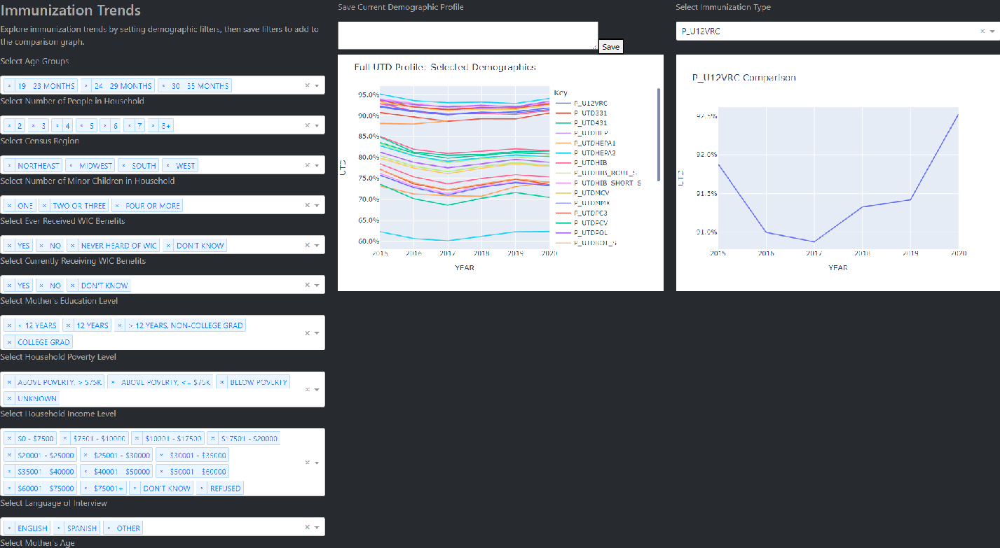

# Immunization Trends
 Interactive dashboard utilizing publicly-available CDC immunization survey data to explore child immunization trends
 
 ## About
 This dashboard allows you to explore the data provided by the Centers for Disease Control and Prevention's National Immunization Surveys. The original data, as well as extensive user guide and questionnaire, can be found [here](https://www.cdc.gov/vaccines/imz-managers/nis/datasets.html). For convenience, I have included the .R scripts as well as the .DAT and .RData files needed to follow this project from beginning to end. Please note that all R scripts have been utilized in their original form as provided by the CDC.
 
 Interacting with the demographic options provided on the leftmost side of the dashboard updates the center graph to include only the data rows matching that description. Please note that selecting *no* options from any given category will output as if all options were selected (otherwise zero rows would be returned). Once you've set up a demographic profile, you can save it with a descriptive name above the graph. Then, going to the rightmost graph and selecting an immunization type will populate the line graph with all saved demographic profiles, as well as the baseline "All". 
 
 As this dashboard is built with Plotly Dash, these graphs are inherently highly interactive. Lines can be selected or hidden, areas can be zoomed in, and displays can be saved to your local machine. A tooltip provides specific information on hover.

## How To Run
After cloning this repository, setting up a virtual environment, and installing required packages, you can run this app locally with `python app.py` and then opening a browser window and going to localhost:8501. This app is set to use port 8501, which can be changed in the code as needed.

## Screenshot

